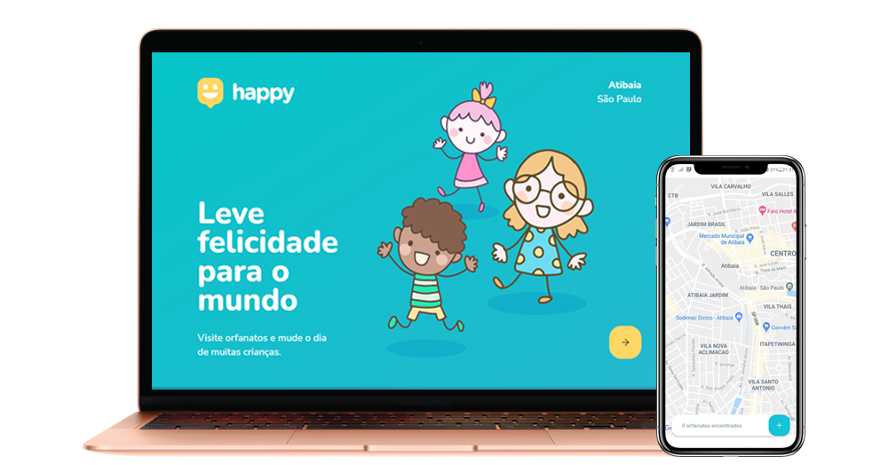

  

  

## 🌐 The Project
- Happy is an application to celebrate Children's Day. In this project orphanages can be registered, showing to other people when it is open for visits, also, showing the route. Helping people to find orphanages to visit, making some kids happier.

## 🚀 Technologies
- Node.js
- React
- React Native
- Typescript
- SQLite
- Expo
 
## ⚙️ To start backend 
 - $ cd backend 
 - $ yarn or npm install (to install dependences).
 - $ yarn dev or npm dev (to start the backend).

## 💻 To start web application
 - $ cd web
 - $ yarn or npm install (to install dependences).
 - yarn start or npm start (to start the web application).

## 📱 To start mobile app
 - Install Expo in your smartphone.
 - $ yarn global add expo-cli or npm install --global expo-cli (to install Expo CLI)
 - $ cd mobile
 - $ yarn or npm install (to install dependences).
 - yarn start or npm start (to start the mobile app).
 - Read the QR Code using the Expo app.

